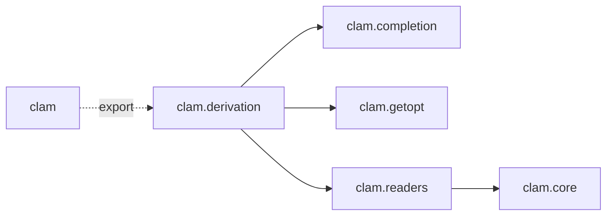
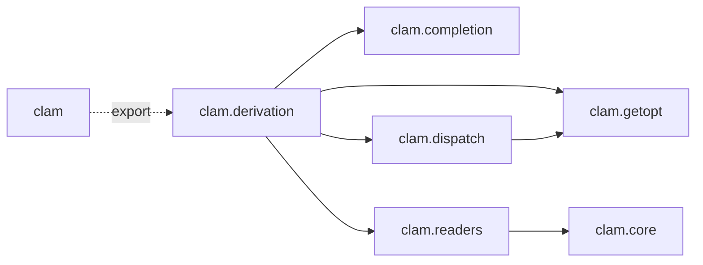

*Command-Line Argument Mapper*

Generate command line parsers for Scala case classes

## Example

```scala
case class Cli(
  param1: String = "foo"
  param2: Int
) derives clam.default.Command


```

## Maven Coordinates

```scala
ivy"io.crashbox::clam::0.0.1"
```

## Code Structure





## How It Works

Distinguish:

- CLI parameter: a parameter whose arguments are given on the command line.

  E.g in `ls -A foo/` the parameters are `-A` and the path to list, given as
  argument `foo/` in this case.

  A CLI parameter can be of two kinds:

  1. named
  2. positional

  A *named* parameter must start with `-` (or `--`), and can appear *anywhere*
  on the command line. If a named parameter takes an argument, it must be given
  to it must appear directly after it or be embedded in the parameter with an
  `=`. E.g. `--foo bar` or `--foo=bar`.

  Note: in other libraries named parameters are sometimes referred to as *flags*
  or *options*. We do not use this vocabulary since it implies that named
  parameters are always optional.

  A *positional* parameter is defined by its position. Arguments are assigned in
  the order in which they are encountered.


- Scala parameter: a parameter declared in a class or method.

Clam generates parsers that map CLI parameters to Scala parameters.

- Scala parameters with a default value are mapped to optional named parameters.
- Scala parameters without a default values are mapped to positional parameters.

Special cases:

- Boolean parameters with default value are mapped to so-called "flags". A flag
  is named parameter which does not take an argument. Its presence determines if
  the parameter should be set.

- Parameters of type `_ <: Iterable[_]` are mapped to repeated CLI parameters.

  - In case the parameter has a default value, it becomes a repeated named
    parameter: all occurrences are concatenated.

    ```scala
    case class RepeatedDefault(name: Seq[String] = Seq())
    ```

    ```
    --name a --name b --name c
    ```


  - In case the parameter does not have a default value, it becomes a repeated
    positional parameter. Such a parameter will consume all remaining positional
    arguments.

## Subcommands


## Reusable Parameter Groupings


```scala
case class Common(

)
```
