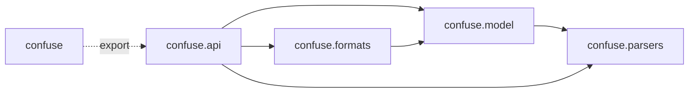
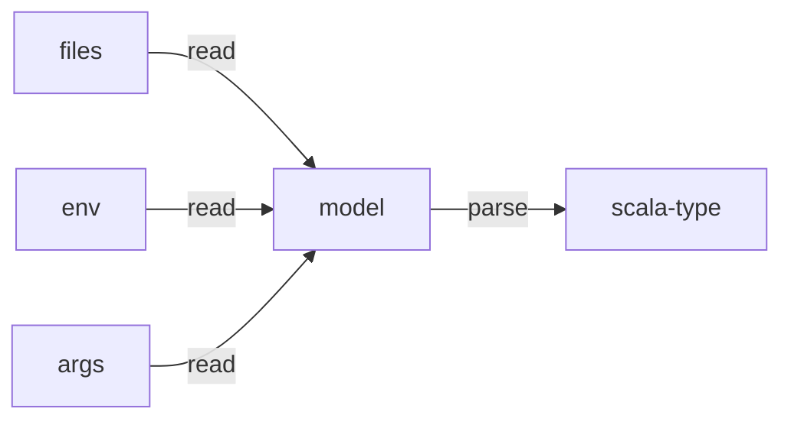

Parse and map configuration from multiple formats

## Example

```scala
{}
```

## Maven Coordinates

Scala 3, JVM and Native

```scala
ivy"io.crashbox::confuse::"
```

## Code Structure

Tthis the intended dependency graph between packages:



## Control flow

