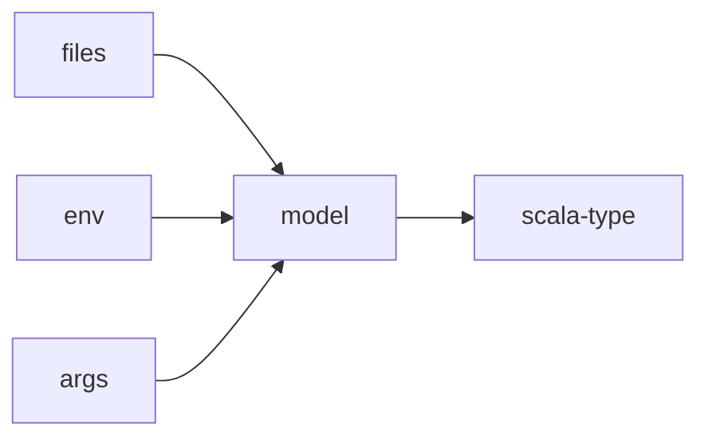

## Code Structure

```mermaid
flowchart LR
  confuse .-> |export| confuse.api;
  confuse.api --> confuse.model;
  confuse.api --> confuse.formats;
  confuse.formats --> confuse.model;
  confuse.model --> confuse.mapper;
  confuse.api --> confuse.mapper;
```

## Control flow

```mermaid
flowchart LR
  files --> model;
  env --> model;
  args --> model;
  model --> scala-type;
```
