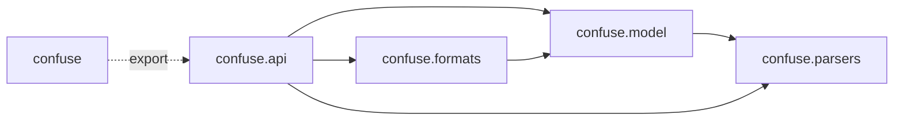
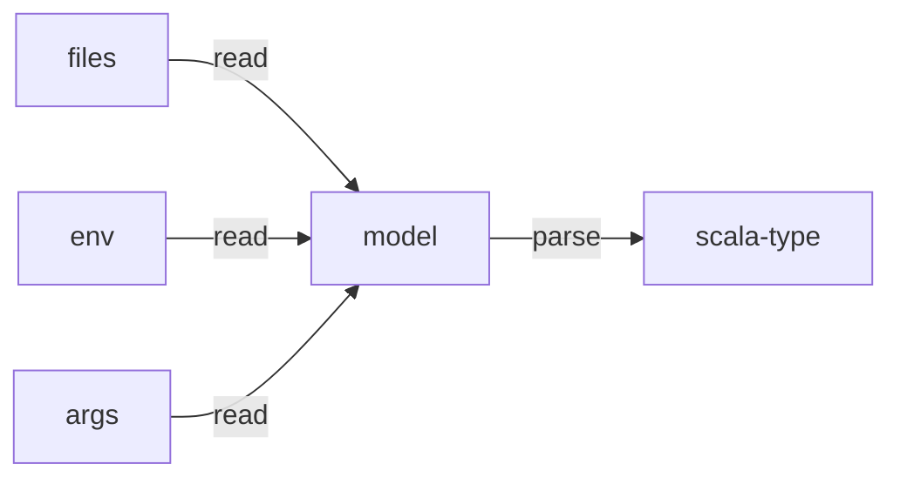

```scala
case class Foo(
  name: String,
  value: Int = 42
) derives confuse.default.Parser

case class Settings(
  x: Int = 2,
  data: Map[String, Foo]
) derives confuse.default.Parser

def main(args: Array[String]): Unit =

  // read raw config (this cannot fail except for syntax errors in the config files)
  val config = confuse.read(paths = Seq(os.pwd / "config.yaml"))
  println("raw config result")
  println(config.dump())

  // map the config to a scala value or exit, showing any errors
  val settings = config.parseOrExit[Settings]()
  println(settings)

```

## Code Structure

Tthis the intended dependency graph between packages:



## Control flow

